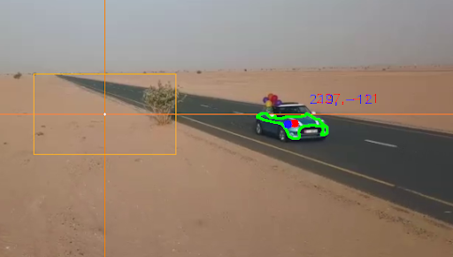

# DGMD_Robotics
## Homework A4 Instructions
<br>
<div>
   <a href="https://github.com/ultralytics/yolov5/actions"></a>
</div>

## <div align="center">Documentation</div>

This document has instructions for how to operate the code in this Homework A4 Repo.


## <div align="center">Install Dependencies</div>

1. Install PX4 Simulator:
```bash
	cd ~/  # To change directory to your home directory

	wget https://raw.githubusercontent.com/PX4/Devguide/v1.9.0/build_scripts/ubuntu_sim.sh

	source ubuntu_sim.sh
```
After the installation finishes, the directory will be automatically changed to: ~/src/Firmware


2. To compile the Gazebo simulator, run:
```bash
	make px4_sitl gazebo
```

3. To install MAVSDK-Python, simply run:
```bash
	pip3 install mavsdk
```

To clone the MAVSDK-Python repository with the basic examples, simply run:
```bash
	cd ~/  # To download the repository in your home directory
	git clone https://github.com/mavlink/MAVSDK-Python.git
```

4. Install QGroundControl:

Add required modules:
```bash
	sudo usermod -a -G dialout $USER
	sudo apt-get remove modemmanager -y
	sudo apt install gstreamer1.0-plugins-bad gstreamer1.0-libav -y
```

Logout and login again to enable the change to user permissions.

Next:
	- Download QGroundControl.AppImage.
	- Install (and run) using the terminal commands:
```bash
	  chmod +x ./QGroundControl.AppImage
	  ./QGroundControl.AppImage  # (or double click)
```

## <div align="center">Run Detect and Test</div>



Make sure Pexels video (Pexels Videos 1572547_540p.mp4) is stored in the same directory as python script and run:

```bash
	python3 detect_test.py
```

## <div align="center">Run Track and Follow</div>
